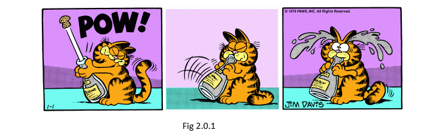
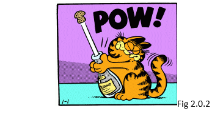
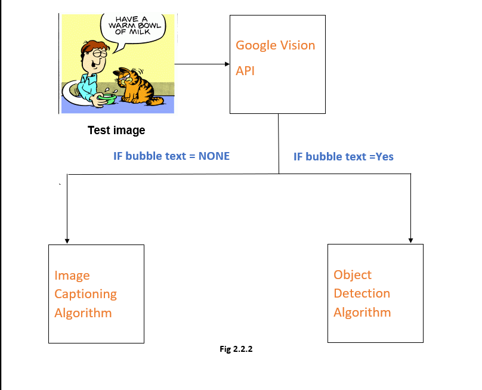
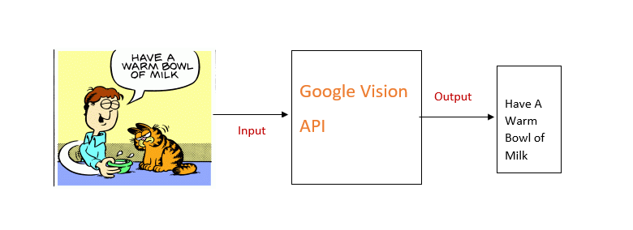
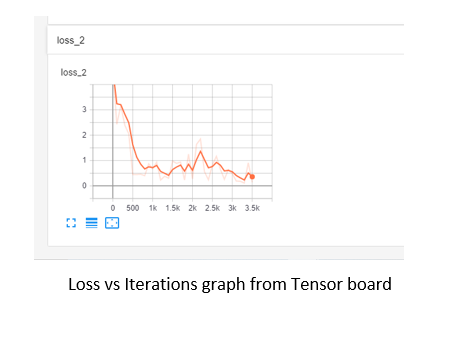
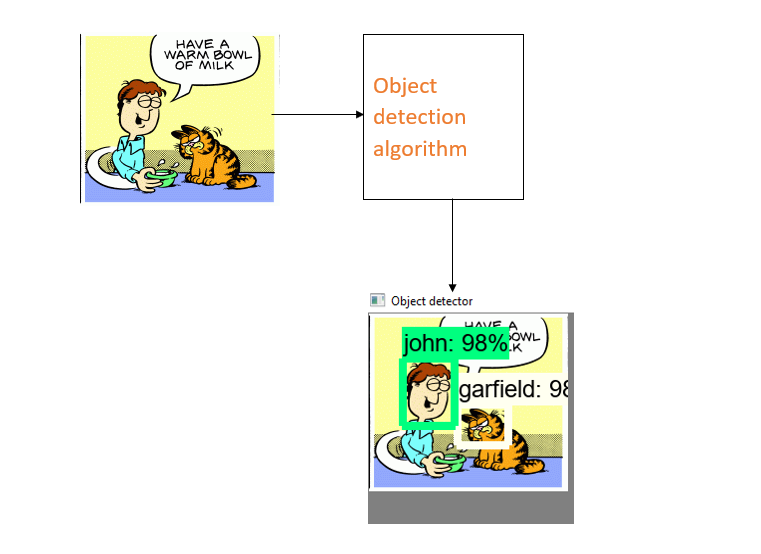
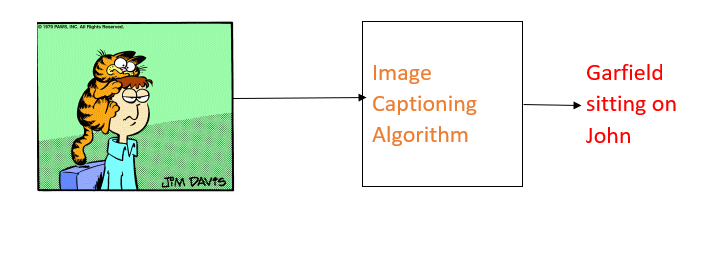
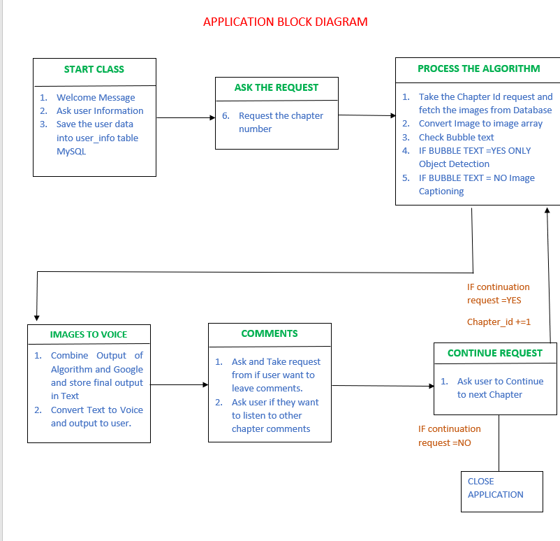
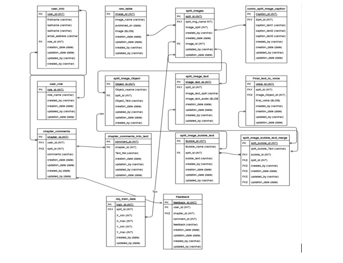

# Table of Contents
1. ## Introduction
    1. ### Abstract                                                          
    2. ### Project Scope and Deliverables                     
    5. ### Use Case and Sequence Diagrams              
    6. ### Technologies 			               	
2. ## Proposed Solution
    1. ### Methodology Overview		
    2. ### Data Collection & Preprocessing
    3. ### Design Algorithms 
    4. ### Connection with Database     
    5. ### Integrate with Google Vision API
    6. ### Integrating entire application
    7. ### Frontend Design for application
3. ## Database Design					
    1. ### ERD Diagram
    2. ### Normalization 
    3. ### Database Manipulations
4. ## Prototype						
    1. ### Programming Language Overview
    2. ### Requirements 
    3. ### Code
5. ## Future Scope							
6. ## Conclusion							
7. ## References

## Introduction
### Abstract
Reading a comic book can be a daunting task. especially, the sequence of events and few expressions are much difficult to understand just imagine how difficult it will but reading comic books gives struggling readers confidence and changes reluctant readers into ravenous readers and the experience is wonderful. This made us wonder how blind people can get the same experience. So, this thought gave us the idea to work on a project which will help blind people to get the same experience or close to the same experience as reading a book. We are going to create an ensemble model which will take in voice input from the blind user such as a particular chapter number and then the model will check if the chapter exists if it exists it will begin reading the particular chapter to the user and if it doesn’t it will again request the user for a chapter number The user will also be able to comment his views about the chapter using his voice. We are going to develop this model using deep neural networks, natural language processing and google API.


### Project Scope and Deliverables
*	Our goal is to create an ensemble model using deep neural networks which will convert images to signals to train the images. 
*	Natural language processing to translate the comic images into audio for blind individuals which would help the blind user understand what is in a comic book.
*	We came up with this idea because when we all read books and we all love the experience it gives us.
*	We decided that we want to give the same experience or as close to the same experience as possible to a blind individual.

### The Scope of the project is as follows:
*	Collect the Garfield comic images and categorizing them into characters, expressions, and background objects.
*	Label the data based on the objects in the comic image (eg: face, books, etc.) 
*	Augmenting and storing data that will be stored in the Database (Relational Database).
*	Performing Object Detection, Google Vision API and Image Captioning model algorithms and predict the comic image-based the objects in the picture.
*	Creating a web application/user interface using DJANGO framework to integrate python and frontend application created by HTML, CSS and bootstrap.


### USE CASE AND SEQUENCE DIAGRAM
The below is the use case diagram for our project: In the perspective of blind person.
  *	**Actor**: The Blind person can do all the following, which is Start the application, pause it etc.
  *	**Database Actor**: We have created database as our actor as most of the interactions will happen with the database with whatever input the user gives.
  *	**Chapter Number**: User will speak a chapter number which will hit the database and see if the chapter number exists in the database. If not, then it will say that the chapter does not not exists else will show the chapter number and read the text that belongs to it from the database.
  *	**Speech Communication**: This layer will take in the user voice, which can be comments on the chapter or speaking the chapter number for him to listen the comic.
  *	**Application Layer**: This is nothing but the front-end application which can be used to interact with the user for taking his inputs.
  *	**Model Layer**: here is where all the algorithm has been written and all the object detection and image captioning will take place.


### Sequence Diagram

•	The actor will provide a voice command with the chapter number which will reach the application layer and validate if the chapter number exists in the database and if the chapter does not exist in the database. If the chapter matches, then the application layer will fetch images from the database and display in the frontend application and gives a voice output to the user for the corresponding chapter comic.

•	One more use case is that once the chapter matches to the database and gives output as voice text, there is an additional feature that provides the blind user to provide comments or feedback on the existing comic chapter and stored in the database.

## TECHNOLOGIES
### Programming Languages
-	**Python** 
-	**HTML**
-	**JavaScript**

### Database  
- **MYSQL**

### Frameworks       
- **TensorFlow** 
- **Keras**
- **Django**
- **Bootstrap**

### Algorithms and API used

-	**TensorFlow Object Detection API**
-	**Neural Image Captioning Algorithm**
-	**GCP Google Vision API** 

## PROPOSED SOLUTION
### Methodology Overview
*	As mentioned in scope our idea is to convert the comic images to the voice so that blind person will be able to understand it without effort,
*	To do so we are using help of Machine Leaning algorithms and all our data is stored in the backend MYSQL database
*	There are total of 14 Tables in our database Schema (refer to ERD diagram in the section 2.2.1), ‘Image_comic’ is table where we stored entire comic strip images (refer to Fig 2.0.1 to check comic strip image)

| |
| :--: |
					    
*	Everyday Garfield comic authors release a strip which contains 3 separate images in one strip.
*	In second, step we separate the split images and Store it in the table image_split, in this table we have composite key which is combination of ( Image_id (primary key in table image_comic) + Surrogate key (from 1 to 3)). Each row in the image_split table represents the separate image (refer Fig 2.0.2 to check split image of 1st image in strip one). 

| |
| :--: |

*	For this image we have splid_id 1, image_id 1 since it is an 1st image in strip and the functioning of algorithm is explained more briefly in next sections.

### Data Collection
*	For this application we are only sticking to Garfield comic and our team researched and got the entire comic data. Please refer the link to download data  http://pt.jikos.cz/garfield/   ( also mentioned in references)
*	Our Data formatted from 1978-2020, we scraped entire data using the python script and stored it on local disk which will in turn be linked to python script
*	We removed 5 strip images as mentioned in the above section Limitations.
*	Here is Python Snippet to download the code using selenium module.

```python
from selenium import webdriver
import urllib
import time
start_year=1979
end_year=2020
start_month=1
end_month=12
driver=webdriver.Chrome(r'path_to\chromedriver')
counter=1
for year in range(start_year, end_year+1):
    for month in range(start_month,end_month+1):
        url='http://pt.jikos.cz/garfield/'
        url=url+str(year)+str('/{}/'.format(month))
        driver.get(url)
        time.sleep(2)
        comics=driver.find_elements_by_tag_name("img")
        for comic in comics:
            image=comic.get_attribute("src")
            comic_image=urllib.request.urlopen(image)
            local_image=open(r'path_to\images\{}.jpg'.format(counter),'wb')
            local_image.write(comic_image.read())
            local_image.close()
            counter+=1
    time.sleep(2)
```


## Design Algorithm 
### Overview
*	Once the data is collected it is split and stored in Image split table which we created in backend MYSQL, then we segregate data, we split the Data into Train and Test datasets.
*	Before using the training data to train the algorithms we would like to give a high process flow of our application below:

| |
| :--: |

*	Our Team researched with several Machine learning algorithms for best suite of application, our main reason for selecting image captioning and Object detection model is based on type of our image sets, Our image set consists of 2 types of images one is with bubble and another without bubble in images.
*	So, we used Google Vision API which is an API developed by Google and available on Google Cloud Platform. The main idea of Google Vision API is to read bubble text from image and output a content Inside the bubble (more details of Google vision API integration to Python code can be found in section 2.1.4)  But here is an quick overview of how Google vision API works.

| |
| :--: |
 


*	Above, figure shows an clear example of how Google API works, we have bubble text saying in image whenever we do API call and check the bubble text it will output what inside the bubble text, this is an main key for out next steps to the application to the algorithms.


## Design of Object Detection model using TensorFlow API
### Data preparation:	
*	Since it is a object detection where we need the machine to understand which image is what character, we used trained dataset as mentioned above and prepared annotations for those images using a tool called ‘Labelimg’ in python to perform the annotations, download link is available in the references section.
Build 
*	Initial stage is to build the Object detection model for which we used TensorFlow API to build entire build process which was very huge and meticulous but you can find the attachments or requirements.txt fie in references to install prerequisites and create the model using TensorFlow but the key point in build process is Generating TF records and then build the object detection model.
*	We used Mobilenet v2 models due to accuracy constraint then we switched to Fast RCNN inception v2 model at the end.
*	Once we built it and generated a .h5 (weights) file and inference graph we can use the model with new data.

                       

| |
| :--: |

*	 We are showing a loss function vs iteration for our object detection model from in the above image, at the checkpoint 3400 our team noticed a minimum loss, so designed our object detection mode to use checkpoint 3400 to generate weights.
#### Final model
*	Once Google API extracts bubble from the image, in next step we send the same image to our Object detection model, where it will predict the objects inside the images. For example, here is a sample output from the object detection algorithm. 


| |
| :--: |


						 

*	So, once we get the objects and final bubble text from the object detection and Google API respectively, we save objects and bubble text in python memory and convert those text into speech and provide an output to the user request chapter number. (fetching records from database using the user command can be discussed more in below section connection to database)

## Design of Image captioning model
Image captioning model is another important model in our application which runs parallelly with object detection model. When we receive the bubble text = None we use image captioning model as an alternative to get the text from image using the concept of neural image captioning.
### Data preparation:	
*	We prepared our own data for image captioning model all the data is available in MYSQL image_split_caption model all the data into database is entered manually.
Build 
*	Image captioning is model is one of non-sequential model in the machine learning it is a greatly inspired models still developers are striving for the accuracy for this model.
*	In image captioning model we use image features and sentence tokens as an input to predict next word.
*	For our project team used pretrained model VGG 16 and LSTM model to build captioning model. We generated image features from VGG16 and gave input to LSTM memory cell and similarly we give vocab tokens as inputs to each layer of LSTM. (entire code Is referenced in GitHub for link please check the GitHub link in section 3.3 once you go to GitHub open model  model.py file for more understanding)
Training model
*	Model can be trained using the data from Image_Captioning Model and  can be found under data folder.
*	We used keras API and tensorflow backend to use the model.

## Evaluation
*	Because of Limited Data our model didn’t perform that great, but here is an example of our model without a bubble text, since it does not have the bubble text it will fail the if condition and the image is processed using the Image Captioning Algorithm
*	Here is the Snippet from our main.py file the logical statement which separates both the algorithms executions.
```python
bubble_text = api_call.api_call(image)
txt_bubble = bubble_text.detect_text()

if txt_bubble is None:
    gen_text= model.predict(image)
```
*	Down Below we are Projecting an output of an image from our mode.

| |
| :--: |


### Connection with Database     
*	Since we are using MySQL as Backend here to store data and perform all the operations it is very important that we need to connect with the database every time to do manipulations.
*	We are using Mysql-connector to connect with Mysql Database from python and here Is a sample code of how we can retrieve information from the database.
```python
def fetch_comments(self, chapter_id):
    self.chapter_id = chapter_id
    try:
        connector = MySQLConnection(user='username', password='enter_password',
                                    host='127.0.0.1',
                                    database="project")
        cursor = connector.cursor(buffered=True)
    except Error as e:
        print("connection error {}".format(e))
        sys.exit()
    try:
        # check the values in the database
        insert_command = "SELECT comments FROM chapter_comments WHERE chapter_id={}".format(chapter_id)
        cursor.execute(insert_command)
        comments = cursor.fetchall()
        ## seprate test
        connector.commit()
        return comments
    except:
        print("cannot insert user information into DB")
        return None
```
*	Here in the code, the important part is to connect with the database, that connection part Is fulfilled by this part of code
```python
try:
        connector = MySQLConnection(user='username', password='enter_password',
                                    host='127.0.0.1',
                                    database="project")
        cursor = connector.cursor(buffered=True)
    except Error as e:
```
*	Then we are fetching information from Mysql Db and store it in python memory and process the flow. The processing application is briefly explained in 2.1.5 Integrating the entire application section.

## Integrate with Google Vision API

### Overview
*	One of the Major Parts of our project is to extract the bubble text from the bubble present in most of the comic images and we researched several alternatives but fortunately, we were able to find out Google vision API which helps to extract the text from the image.
*	Google Vision API uses a concept called high-end Optical Character Recognition (OCR) that enables us to extract the text from images.

### Configuration 
*	To Configure Google vision API to our python project some mandatory pre-requisites need to be completed.
*	As GCP is a cloud platform we need to use authentication keys to make API calls from local to Cloud.
*	First create an account and start a project in Google Cloud here is a [link](https://cloud.google.com/docs/overview#projects) to start a project in Google Cloud Platform (GCP) project and enable the vision API  to that account.
*	The next step is to acquire the authentication keys which would be available to download in JSON format. We need to Download that to our local file system to use the Google Vision API in code.

## Usage
Here is a small python code snippet of using the google cloud vison in our python code.
```python
from google.cloud import vision
def __init__(self,image_bytearray):
    credential_path=r” Path to download json file)
    os.environ['GOOGLE_APPLICATION_CREDENTIALS'] = credential_path
    self.image_bytes=bytes(image_bytearray)
```
*	Our code explains importing necessary modules and giving a link to the credential path (i.e is downloaded JSON file), then we set the path to OS path variable to that it can be easily accessed from anywhere.
```python
def detect_text(self):
    """Detects text in the file."""
    client = vision.ImageAnnotatorClient()
    # with open(self.path, 'rb') as image_file:
    #     content = image_file.read()
    content=self.image_bytes
    image = vision.types.Image(content=content)
    response = client.text_detection(image=image)
    texts = response.text_annotations
    bubble_text= texts[0].description
    bubble_text=str(bubble_text).strip()
    if len(bubble_text)<5:
        bubble_text=None
   if response.error.message:
      raise Exception(
        '{}\nFor more info on error messages, check: '
        'https://cloud.google.com/apis/design/errors'.format(
            response.error.message))  
   return bubble_text
```
*	The rest of the code explains the usage of the Image Annotator module from Google API and detecting out image array.
*	Integrating out Google API code to our application can be found in the future Section.


## Integrating entire application
*	Integrating entire application is a Complex and Meticulous process, this can be clearly explained in this section. 
*	Once we start the application the flow of application is as shown Below.
           
| |
| :--: |


*	So, this is entire process of application flow the entire Interaction Reponses are programmed to our Comic bot (more information about programming t will be covered in future section)

## Frontend Design for application
Django is a free and open source web application framework written in Python. A framework is nothing more than a collection of modules that make development easier. They are grouped together, and allow you to create applications or websites from an existing source, instead of from scratch.

This is how websites - even simple ones designed by a single person - can still include advanced functionality like authentication support, management and admin panels, contact forms, comment boxes, file upload support, and more. 
In other words, if you were creating a website from scratch you would need to develop these components yourself. By using a framework instead, these components are already built, you just need to configure them properly to match your site.

Django is an open-source framework for backend web applications based on Python — one of the top web development languages. Its main goals are simplicity, flexibility, reliability, and scalability.
Django has its own naming system for all functions and components (e.g., HTTP responses are called “views”). It also has an admin panel, which is deemed easier to work with than in Lavarel or Yii, and other technical features, including:
*	Simple syntax;
*	Its own web server;
*	MVC (Model-View-Controller) core architecture;
*	“Batteries included” (comes with all the essentials needed to solve solving common cases);
*	An ORM (Object Relational Mapper);
*	HTTP libraries;
*	Middleware support; and
*	A Python unit test framework.

## Database Design
## Overview 
*	As we mentioned Before we are using MYSQL as a Backend for our application in this section and upcoming sections we introduce to our application Database 
## ERD Diagram
*	ERD Is an Entity Relationship Diagram which depicts the relation between Entities in the tables here is our high overview of ERD Diagram.
 
| |
| :--: |


### Explanation
*	When the app is launched as mentioned in section 2.1.5 our Comic bot will communicate with blind user and takes user information and process that information into user_info table.
```python
insert_command = "INSERT INTO user_info(user_first_name, user_last_name, user_phone_number) VALUES(%s,%s,%s)"
cursor.execute(insert_command, insert_values)
connector.commit()
```
*	In second step, chapter numbers the model searches in the database if the chapter number exists in the database, if not it will say that chapter does not exist. If exists we retrieve images and send the images related to chapter id to algorithms.

*	**Image_bubble** : This table stores text from the bubble which we extract from the google vision api and stored in the database with image_id as the foreign key for the text.

*	**Image_split_Caption**: This table store the Caption that we manually fed inside the database, this will work when the image or strip does not have a bubble and based on the captions it will find the best possible output based on the captions provided.

*	**Chapter_comments**: This table stores the feedback that the blind user gives for the chapter and stores in this table. With the user_id and image_iid information to keep track of the data.

## Normalization
### Database Normalization  
*	Normalization is the process of organizing the attributes of the database to reduce or eliminate data redundancy. Data redundancy unnecessarily increases the size of the database as the same data is repeated in many places. Inconsistency problems also arise during insert, delete and update operations. It divides larger tables to smaller tables and links the musing relationships.
*	Normalization used for our database: Third Normal Form(3NF)
*	A relation is in third normal form if there is no transitive dependency for non-prime attributes as well as it is in second normal form.

 


### Database Manipulations
* Views: (The below view is created for faster retrieval of data from 2 or more different tables using a subquery inside it)
```sql
CREATE
	ALGORITHM = UNDEFINED
	DEFINER = `root`@`localhost`
	SQL SECURITY DEFINER
VIEW `comic`.`user_comments` AS
	SELECT
        `comic`.`user_info`.`User_id` AS `user_id`,
        `comic`.`user_info`.`user_first_name` AS `user_first_name`,
        `comic`.`user_info`.`user_last_name` AS `user_last_name`,
        `comic`.`chapter_comments`.`Chapter_id` AS `chapter_id`,
        `comic`.`chapter_comments`.`user_comment` AS `user_comment`,
        `comic`.`chapter_comments`.`ratings` AS `ratings`
	FROM
        (`comic`.`user_info`
    	JOIN `comic`.`chapter_comments` ON ((`comic`.`user_info`.`User_id` = `comic`.`chapter_comments`.`User_id`)))
	WHERE
    	(`comic`.`chapter_comments`.`Chapter_id` = 7)
``` 
**Procedures and Functions**
* (Below function is created for taking an integer as parameter and returning a text based on the curren rating number.) 
Function1: This function takes input as rating return a comment for the corresponding rating using the procedure.
```sql
CREATE DEFINER=`root`@`localhost` FUNCTION `rating_review`(rating int) RETURNS varchar(100) CHARSET utf8mb4
	DETERMINISTIC
BEGIN
        	DECLARE hi varchar(100);
  if(rating = 1) THEN
        	SET hi = 'Very Good';
        	ELSEIF (rating = 2) THEN
                    	SET hi = 'GOOD';
        	ELSEIF (rating = 3) THEN
                    	SET hi = 'Satisfactory';
	ELSEIF (rating = 4) THEN
                    	SET hi = 'Not Satisfactory';
	ELSE
                    	SET hi = 'Bad';
        	END IF;
  RETURN hi;
END
```
* Procedure that calls the above function with view created above(user_comments) and used to display the feedback of the customer when this procedure is called.:
```sql
CREATE DEFINER=`root`@`localhost` PROCEDURE `GetComicReview`(IN s_comment_id INT)
BEGIN
        	DECLARE review VARCHAR(100);
	select rating_review(ratings) into review FROM User_comments
	where comment_id = s_comment_id;
	if(review = 'Very Good') THEN
                    	SELECT 'This is a very good comic till date' as "Feedback";
    	ELSEIF (review = 'GOOD') THEN
                    	SELECT 'This is a Good comic' as "Feedback";
    	ELSEIF (review = 'Satisfactory') THEN
                    	SELECT 'This is an average comic' as "Feedback";
    	ELSEIF (review = 'Not Satisfactory') THEN
                    	SELECT 'This comic is not satisfactory as per the user' as "Feedback";
    	ELSEIF (review = 'Bad') THEN
                    	SELECT 'This is a very Bad comic' as "Feedback";
        	END IF;
END
```
 


* Procedure calling the above function 2(this procedure is used for fetching the user name of the user using the role_id which we passed in the function)
```sql 
CREATE DEFINER=`root`@`localhost` PROCEDURE `GetRoleName`(IN rolename varchar(30))
BEGIN
	DECLARE username varchar(30);
	SELECT concat(user_info.user_first_name,’ ‘, user_info.user_last_name) into @username from user_info, user_role
	WHERE
                    	user_role.role_id = check_role(rolename)
    	and user_info.role_id = user_role.role_id
    	LIMIT 1;
END
```

* Procedure  to show how old the comic chapter is by calculating the date difference of comic published and current date.
```sql
CREATE DEFINER=`root`@`localhost` FUNCTION `no_of_years`(date1 date) RETURNS int
	DETERMINISTIC
BEGIN
 DECLARE date2 DATE;
  Select current_date() into date2;
  RETURN day(date2)-day(date1);
END
```

**Subqueries:**
```sql
*	select user_comment from chapter_comments
where user_id in (select user_id from user_info where user_first_name = 'John');
```

*	This subquery is used to retrieve the user names and checking if the rating matches to the chapter Id.
```sql
SELECT u.user_first_Name, u.user_last_name, c.ratings = (SELECT COUNT(ratings) FROM chapter_comments WHERE chapter_id = 7 limit 1)
  	FROM user_info u, chapter_comments c
```

## Programming Language Overview
*	For our Application, the major programming Language we used is Python and MYSQL scripting Language. MYSQL is a ubiquitous database used in most of Organizations and Applications. Secondly, Python is a Commonly used Language for building Machine learning algorithms.
*	All the Technologies are mentioned in the above section and rest of the application code will be mentioned in the code section below.
3.1 Requirements
*	Our application requires Python 3.7 or higher and MYSQL workbench 8.0 this are basic requirements and rest of requirements can be found at requirements.txt file, here is an overview of all the libraries used in the application 
```
mysql-connector-python              : To connect with MYSQL
Pillow                              : Image manipulation library
SpeechRecognition                   : To recognition Voice speech from a blind user
gTTS                                : To convert Text to speech 
google-cloud-vision                 : To integrate Google vision
Django                              : used for Frontend
Django_extensions                   : used for Frontend
Ipython                             : to debug Code
tensorflow==1.15.0                  : For Machine Learning Algorithms
opencv-python                       : Image Manipulations
numpy                               : Image to Array Manipulations
matplotlib                          : To visualize
keras                               : Another Framework to process ML algorithms 
selenium,scrapy                     :  Data Scraping
```

## References
•	Garfield [Dataset](http://pt.jikos.cz/garfield/)

•	Annotations tool [Labelimg link](https://www.dropbox.com/s/tq7zfrcwl44vxan/windows_v1.6.0.zip?dl=1)

•	Build TensorFlow [object detection](https://github.com/EdjeElectronics/TensorFlow-Object-Detection-API-Tutorial-Train-Multiple-Objects-Windows-10)
